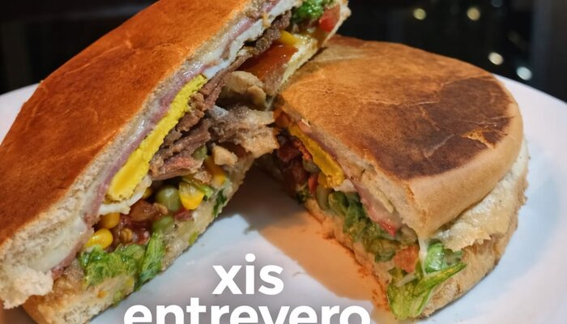

# 🎓 Técnicas de front-end usadas neste projeto

Este arquivo é material de estudo — explica o **porquê** de cada técnica usada no código, não o **o quê** (o código já é autoexplicativo). Não afeta o site publicado; é só leitura.

## 1. Zero build, um HTML por formato

Não existe `npm install`, bundler nem framework. Cada arquivo `.html` é autossuficiente: CSS num `<style>` no `<head>`, sem JS externo. A dor disso é duplicação (mudar um preço = editar em até 7 arquivos); o ganho é que qualquer editor de texto abre e entende o arquivo inteiro, sem precisar rodar nada. Para um site que muda pouco e é mantido por quem não programa, essa troca vale a pena — é o tipo de decisão de arquitetura que só faz sentido quando você conhece as duas pontas do trade-off.

## 2. Variáveis CSS (`:root { --nome: valor }`)

```css
:root {
  --laranja-principal: #ff7043;
  --verde-principal: #66bb6a;
}
```

Troca a cor em um lugar só e ela se propaga para todo `var(--laranja-principal)` no arquivo. Sem variável, a mesma cor apareceria como literal (`#ff7043`) espalhada dezenas de vezes — mudar a identidade visual viraria uma caçada.

## 3. Tipografia fluida com `clamp()`

```css
font-size: clamp(2rem, 8vw, 3rem);
```

`clamp(mínimo, preferido, máximo)`: o `h1` cresce com a largura da tela (`8vw`) mas nunca fica menor que `2rem` nem maior que `3rem`. Resolve, com uma linha de CSS, o que antes exigia várias media queries só para ajustar tamanho de fonte por breakpoint.

## 4. Carrossel mobile com `scroll-snap`

```css
.hero-images {
  display: flex;
  overflow-x: auto;
  scroll-snap-type: x mandatory;
  -webkit-overflow-scrolling: touch; /* inércia suave no iOS */
  scrollbar-width: none; /* esconde a barra no Firefox */
}
.hero-images::-webkit-scrollbar {
  display: none;
} /* esconde a barra no Chrome/Safari */

.hero-img {
  scroll-snap-align: center;
}
```

Isso é um carrossel "estilo Stories" **sem uma linha de JavaScript**. `scroll-snap-type` diz ao navegador "pare o scroll alinhado nos filhos"; `scroll-snap-align: center` diz a cada item "quando parar, fica centralizado". Toda a lógica de swipe/animação que normalmente viria de uma biblioteca (Swiper, Splide) é nativa do CSS desde ~2019.

## 5. `<picture>` + WebP com fallback JPG

```html
<picture>
  <source srcset="img/entrevero.webp" type="image/webp" />
  
</picture>
```

O navegador testa os `<source>` em ordem e usa o primeiro que suporta; se nenhum servir (navegador muito antigo), cai no `` normal. WebP costuma pesar 30-40% menos que JPG na mesma qualidade visual — por isso os pratos carregam rápido mesmo em 4G. O mesmo padrão foi aplicado à logo em 04/08/2026: o arquivo original (`Logo.png`, PNG truecolor de 960 KB) virou `Logo.webp` (41 KB, qualidade 95) + `Logo.jpg` (110 KB, qualidade 92) — **95% menos peso**, sem perda visível, porque o PNG original não usava paleta/compressão eficiente para uma imagem com textos e gradientes suaves.

`loading="lazy"` nas fotos fora da primeira tela adia o download até o usuário rolar até elas; a primeira imagem do carrossel usa `loading="eager"` porque ela é visível assim que a página abre.

## 6. Ícones como sprite SVG (substituindo Font Awesome)

Até 04/08/2026 o `index.html` carregava a folha de estilo **inteira** do Font Awesome via CDN só para usar 6 ícones. Isso foi trocado por um sprite SVG embutido:

```html
<svg style="display: none" aria-hidden="true">
  <symbol id="icon-utensils" viewBox="0 0 448 512">
    <path d="..." />
  </symbol>
  <!-- outros <symbol> aqui -->
</svg>
```

Cada uso vira `<svg class="icon"><use href="#icon-utensils"></use></svg>`. Vantagens sobre a fonte de ícones:

- **Zero requisição externa** — antes dependia do `cdnjs.cloudflare.com` responder; agora o ícone está no próprio HTML.
- **Só os ícones usados** entram no arquivo, em vez da biblioteca inteira (que tem milhares de ícones não usados).
- `fill: currentColor` no CSS faz o ícone herdar a cor do texto ao redor — a mesma técnica que a fonte de ícones usava, só que com SVG.

## 7. Acessibilidade nativa (sem plugin)

```css
.tab-btn:focus-visible {
  outline: 2px solid var(--verde-claro);
}
@media (prefers-reduced-motion: reduce) {
  * {
    animation: none !important;
  }
}
```

- `:focus-visible` (não `:focus`) mostra o contorno de foco só para quem navega por teclado — não aparece ao clicar com mouse/dedo, onde seria só ruído visual.
- `prefers-reduced-motion` lê uma preferência do sistema operacional do usuário e desliga animações para quem tem sensibilidade a movimento. Nenhuma biblioteca faz isso por você; é uma media query padrão do CSS.
- `alt` descritivo em toda imagem (não decorativo) serve tanto para leitor de tela quanto para o `og:image`/SEO.

## 8. Meta tags para compartilhamento (Open Graph)

```html
<meta property="og:image" content="https://.../img/Logo.jpg" />
```

Quando alguém cola o link do cardápio no WhatsApp, é essa tag que decide a imagem/texto do preview. **Precisa ser URL absoluta** (`https://...`) — crawlers de redes sociais não resolvem caminho relativo (`img/Logo.jpg`) porque abrem a página fora do contexto de navegador normal.

## 9. Versões impressas em unidades físicas (mm/cm)

Os arquivos `cardapio-impressao-*` usam `width: 78mm` em vez de `px` ou `rem`. Para tela, unidades físicas não fazem sentido (o "tamanho real" depende da densidade de pixels do monitor); para impressão, fazem — `78mm` sai fisicamente como 78mm no papel, independente da configuração do navegador. É a diferença entre desenhar para uma tela (unidades relativas) e desenhar para um pedaço de papel (unidades absolutas).
